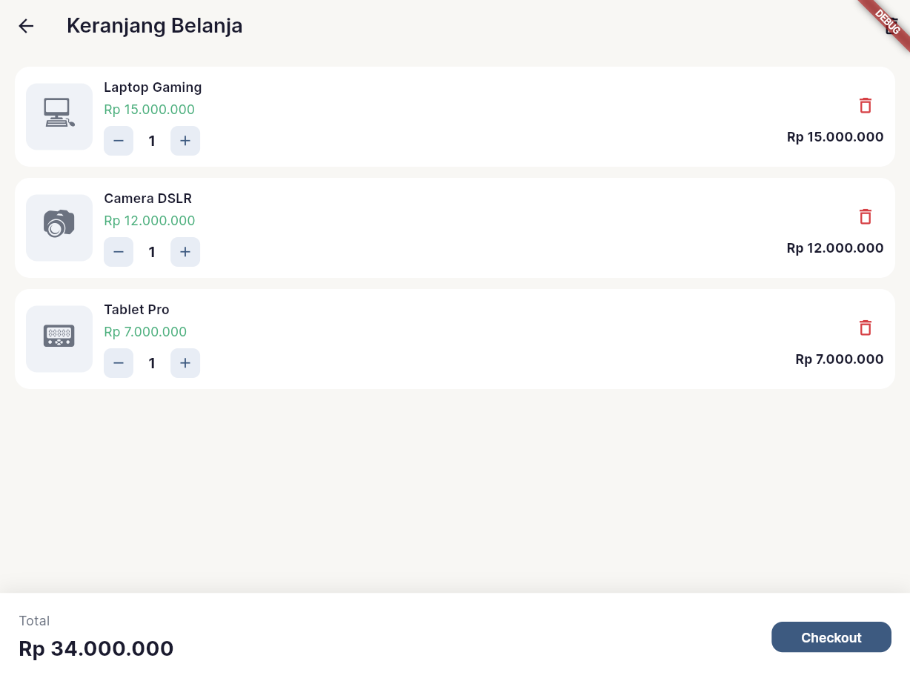
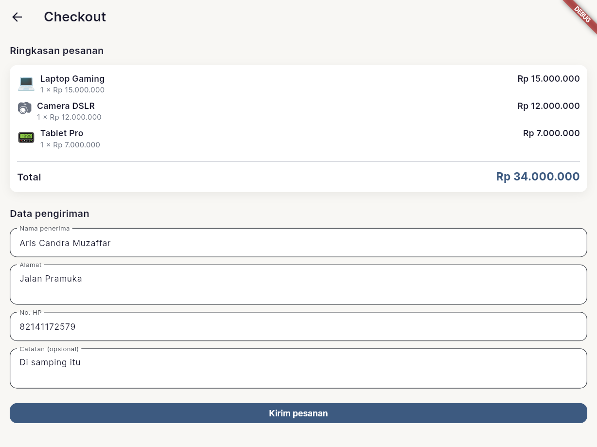

<a name="top"></a>

<p align="center">
  
  
  
</p>

<h1 align="center">Keranjang Belanja</h1>
<p align="center">
  <i>Aplikasi keranjang belanja mini (shopping cart) dengan Flutter + Provider untuk mempraktikkan state management.</i>
</p>
<p align="center">
  <b>Aris Candra Muzaffar</b> · 2409116088
</p>

---

## Daftar Isi

- [Daftar Isi](#daftar-isi)
- [Deskripsi](#deskripsi)
- [Fitur](#fitur)
- [Konten](#konten)
- [Stack](#stack)
- [Struktur Proyek](#struktur-proyek)
- [Cara Menjalankan](#cara-menjalankan)
- [📸 Tampilan Setiap Section](#-tampilan-setiap-section)
  - [Halaman Produk (Laman Utama)](#halaman-produk-laman-utama)
  - [Pencarian Produk](#pencarian-produk)
  - [Filter Kategori](#filter-kategori)
  - [Halaman Keranjang](#halaman-keranjang)
  - [Keranjang Kosong](#keranjang-kosong)
  - [Halaman Checkout](#halaman-checkout)

---

## Deskripsi

**Keranjang Belanja** adalah aplikasi mobile untuk tugas mata kuliah Pemrograman Aplikasi Bergerak (PAB) Pertemuan 4. Projek ini mempraktikkan state management dengan Provider: daftar produk dengan gambar, pencarian, filter kategori, keranjang belanja (tambah, ubah jumlah, hapus), serta halaman checkout dengan ringkasan pesanan dan form data pengiriman.

Tema custom (Slate Blue × Terracotta) dan aset gambar produk disimpan di `assets/images/`.

---

## Fitur

| Fitur | Keterangan |
|-------|------------|
| Daftar produk | Grid produk dengan gambar (dari `assets/images/`), nama, harga, tombol tambah ke keranjang |
| Pencarian | Filter produk berdasarkan nama (real-time) |
| Filter kategori | Chip kategori: Semua, Elektronik, Gadget, Aksesoris |
| Keranjang | Tampil item dengan gambar, quantity, tombol +/- , hapus item, hapus semua, total harga |
| Checkout | Ringkasan pesanan (dengan gambar produk) + form (nama, alamat, no. HP, catatan) dengan validasi |

---

## Konten

<p>
  
  
  
  
</p>

| Bagian | Keterangan |
|--------|------------|
| Part 1 | Counter dengan setState & tampilan di halaman lain |
| Part 2 | Demo prop drilling: Beranda → Profil → Pengaturan |
| Part 4 | Counter dengan Provider |
| Part 5 | Keranjang belanja — daftar produk, tambah ke keranjang, ubah jumlah, checkout |

<details>
<summary><b>Detail per bagian</b></summary>

- **Part 1:** Counter lokal dengan `setState`, nilai ditampilkan di halaman terpisah
- **Part 2:** Data/state dilewatkan manual antar halaman (Beranda → Profil → Pengaturan)
- **Part 4:** Counter yang di-manage dengan Provider, state global
- **Part 5:** Shopping cart lengkap dengan daftar produk, keranjang, edit jumlah, dan checkout

</details>

---

## Stack

<p>
  
  
  
</p>

| Teknologi | Kegunaan |
|-----------|----------|
| **Flutter** | Framework UI cross-platform |
| **Provider** | State management |
| **Google Fonts** | Custom typography |
| **Tema custom** | Slate Blue × Terracotta |

---

## Struktur Proyek

<details>
<summary><b>Lihat struktur folder</b></summary>

```
assets/
└── images/                 # Gambar produk (laptop.jpg, smartphone.jpg, dll.)
documentation/              # Screenshot untuk README (HALAMAN PRODUK.png, dll.)
lib/
├── main.dart                # Entry point, Provider setup
├── theme/
│   └── app_theme.dart       # Tema Slate Blue × Terracotta
├── models/
│   ├── product.dart         # Model produk (+ imagePath)
│   ├── cart_item.dart       # Model item keranjang
│   ├── cart_model.dart      # Provider keranjang
│   └── counter_model.dart   # Provider counter
└── pages/
    ├── product_list_page.dart   # Daftar produk, search, filter kategori
    ├── cart_page.dart           # Keranjang belanja
    ├── checkout_page.dart       # Checkout (ringkasan + form)
    ├── home_page.dart           # Beranda (Part 2)
    ├── profile_page.dart        # Profil (Part 2)
    ├── settings_page.dart       # Pengaturan (Part 2)
    ├── counter_page.dart        # Counter setState (Part 1)
    ├── counter_display_page.dart# Tampilan counter (Part 1)
    └── counter_provider_page.dart # Counter Provider (Part 4)
```

</details>

---

## Cara Menjalankan

<details>
<summary><b>Prasyarat</b></summary>

- Flutter SDK 3.10 atau lebih baru
- Editor (VS Code / Android Studio) atau terminal

</details>

1. **Clone repository**
   ```bash
   git clone <url-repository>
   cd PAB-Tugas1
   ```

2. **Pasang dependensi**
   ```bash
   flutter pub get
   ```

3. **Jalankan aplikasi**
   ```bash
   flutter run
   ```

   Jalankan di perangkat atau emulator yang sudah terhubung.

---

## 📸 Tampilan Setiap Section

### Halaman Produk (Laman Utama)

<div align="center">
  
</div>

<p align="justify">Laman utama aplikasi. Menampilkan grid daftar produk dengan gambar (dari <code>assets/images/</code>), nama, harga, dan tombol tambah ke keranjang. Di atas terdapat search bar untuk filter berdasarkan nama serta chip filter kategori (Semua, Elektronik, Gadget, Aksesoris). AppBar berisi judul "Produk" dan ikon keranjang (dengan badge jumlah item bila ada).</p>

---

### Pencarian Produk

<div align="center">
  
</div>

<p align="justify">Contoh tampilan setelah pengguna mengetik kata kunci di search bar (misalnya "laptop" atau "smart"). Daftar produk terfilter real-time sesuai nama; jika tidak ada hasil, ditampilkan teks "Tidak ada produk".</p>

---

### Filter Kategori

<div align="center">
  
</div>

<p align="justify">Salah satu kategori dipilih (misalnya Gadget atau Elektronik). Hanya produk dalam kategori tersebut yang ditampilkan. Filter bisa dikombinasikan dengan pencarian.</p>

---

### Halaman Keranjang

<div align="center">
  
</div>

<p align="justify">Halaman keranjang belanja. Setiap item menampilkan gambar produk, nama, harga satuan, kontrol quantity (+/-), subtotal, dan tombol hapus. Di AppBar terdapat tombol hapus semua (ikon tempat sampah). Bagian bawah menampilkan total harga dan tombol Checkout.</p>

---

### Keranjang Kosong

<div align="center">
  
</div>

<p align="justify">Tampilan saat keranjang belum berisi item. Menampilkan ikon keranjang, teks "Keranjang Anda kosong", dan tombol "Lanjut Belanja" untuk kembali ke halaman produk.</p>

---

### Halaman Checkout

<div align="center">
  
</div>

<p align="justify">Halaman checkout berisi dua bagian: (1) <strong>Ringkasan pesanan</strong> — daftar item dengan gambar produk, quantity, harga satuan, dan subtotal, serta total harga; (2) <strong>Form data pengiriman</strong> — nama penerima, alamat, no. HP (wajib), dan catatan (opsional). Tombol "Kirim pesanan" memvalidasi form lalu mengosongkan keranjang dan kembali ke halaman produk.</p>

---

<p align="center">
  <sub>PAB-Tugas1 · Tugas PAB (Pemrograman Aplikasi Bergerak) — Pertemuan 4</sub>
</p>

<p align="center">
  <a href="#top">⬆️ Kembali ke Atas</a>
</p>
